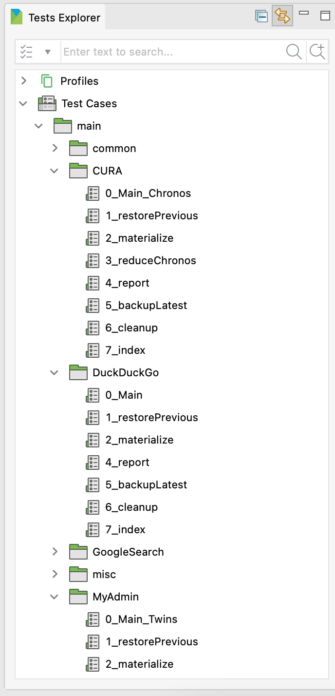

# Inspectus

I would name this project "Inspectus", which means "looking at" in latin.

# Motivation

## 1. Abstract the pattern!

I have created a Katalon Studio project [VisualInspectionInKatalonStudio_Reporn v0.12.1](https://github.com/kazurayam/VisualInspectionInKatalonStudio_Reborn/). This project used the [materialstore library v0.12.1](https://github.com/kazurayam/materialstore/tree/0.12.1).

In the project root directory, I saw this:



I did this:

```
:~/katalon-workspace/VisualInspectionInKatalonStudio_Reborn (develop)
$ tree -L 4 "Test Cases"
Test Cases
└── main
    ├── CURA
    │   ├── 0_Main_Chronos.tc
    │   ├── 1_restorePrevious.tc
    │   ├── 2_materialize.tc
    │   ├── 3_reduceChronos.tc
    │   ├── 4_report.tc
    │   ├── 5_backupLatest.tc
    │   ├── 6_cleanup.tc
    │   └── 7_index.tc
    ├── DuckDuckGo
    │   ├── 0_Main.tc
    │   ├── 1_restorePrevious.tc
    │   ├── 2_materialize.tc
    │   ├── 4_report.tc
    │   ├── 5_backupLatest.tc
    │   ├── 6_cleanup.tc
    │   └── 7_index.tc
    ├── GoogleSearch
    │   ├── 0_Main.tc
    │   ├── 1_restorePrevious.tc
    │   ├── 2_materialize.tc
    │   ├── 4_report.tc
    │   ├── 5_backupLatest.tc
    │   ├── 6_cleanup.tc
    │   └── 7_index.tc
    ├── MyAdmin
    │   ├── 0_Main_Twins.tc
    │   ├── 1_restorePrevious.tc
    │   ├── 2_materialize.tc
    │   ├── 3_reduceTwins.tc
    │   ├── 4_report.tc
    │   ├── 5_backupLatest.tc
    │   ├── 6_cleanup.tc
    │   └── 7_index.tc
    ├── common
    │   ├── BackupAll.tc
    │   ├── Scavenge.tc
    │   ├── createIndex.tc
    │   └── takeScreenshotAndPageSource.tc
    └── reflection
        ├── CommandLocatorRunner.tc
        └── createProcess.tc

7 directories, 36 files
```

As shown, there are many Test Cases. Too many, in fact.

"CURA", "DickDickGo", "GoogleSearch", "MyAdmin" --- these directory contains a repetitive pattern of subdirectories: "0_Main", "1_restorePrevious", "2_materialize", "3_reduceTwins", "4_report", "5_backupLatest", "6_cleanup", "7_index". Too much duplications!

It must be possible to abstract the pattern and to avoid duplications.

## Make it configurable!

I want to make Inspectus configurable, like AWS Services like Lambda. I want to support configuring Inspectus by JSON text. I want to make Inspectus runnable by commandline command like AWS CLI.


